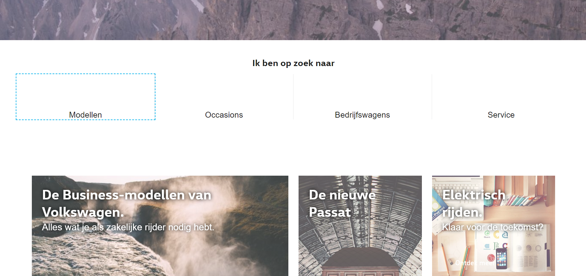

# Project 2 @cmda-minor-web · 2018-2019

## Summary
Performance and accesibility audit for valtech concerning the dutch [volkswagen website](https://volkswagen.nl/).
I made a top 5 of enhancements I think can be implemented relatively easily and cost-efficiently, while making a noticable impact in performance and accessibility of the site.

## Table of contents
1. [Service worker](#1-service-worker)
2. [Focus styles](#2-focus-styles)
3. [Screenreader](#3-screenreader)
4. [Contrast](#4-contrast)
5. [Compression](#5-compression)

## 1. Service worker
There seems to be caching active on the server, but a lot of files will get re-requested every time you reload the page.
To improve the pageload, we can use a [serviceworker](https://developer.mozilla.org/en-US/docs/Web/API/Service_Worker_API). A serviceworker is a program that runs in the background of the browser and is capable of 'hijacking' all requests, and to check if it has the request stored in the cache to serve them from there if possible.

### Situation before serviceworker


As you can see in this network audit, the total load is 4.59s and all the DOMcontent is ready after 2.18s.
In the 'filmstrip' on the top you can see that it takes 1.84s to draw something visible on the screen. That's a wait time of 1.84s on fast 3g, which is a pretty decent internet speed.

The total load time is 4.59s which is stretching the limit of users wanting to wait for your site to load.


### Situation after serviceworker


After adding the serviceworker, the first draw is on 0.529s. A reduction of ~71.25% for the first content on screen!

The total load time is now reduced to 1.91s. A reduction of ~58.3%.

***Caution: Results may vary on the live site***

### Pro's
- It's not a lot of work to implement a decent serviceworker
- More consistent pageloads even on really slow internet connections
- Possibility for offline use and custom offline pages!

### Con's
- It's important to have someone with experience in serviceworkers to write the serviceworker, since its caching strategy needs to be well thought out to prevent overload of users cache.

---

## 2. Focus styles
It's a bit difficult to showcase, but the live website doesn't implement focus styles really well. If users are forced to navigate with their keyboard, they will have a really hard time finding out what element is currently focussed.

### Before applying focus styles


As you can see i'm focussing on the 'modellen' section (see the selected link in the bottom left of above screenshots), but there is no visual clue whatsoever that i'm currently focussed on this element. This is a problem for people who can't use the mouse to navigate the website.


### After applying focus styles
(ignore the images and the lack of icons, this is a local prototype)


As you can see, after applying focus styles if I focus an element it clearly shows a focus ring.
The default styling of the outline property is ugly, most designers would agree. But it's worth spending time to apply it correctly instead of hiding it alltogether!

The focus styles were done by styling the focus state in combination with box shadows or the outline property:
```css
*:focus {
  outline: 2px dashed #00b1eb;
}
.m-tile__anchor:focus {
  box-shadow: inset 0px 0px 3px 3px #00b1eb;
}
```

As a bonus I added a skip navigation link in the header navigation. It's quite annoying to have to tab through a long navigation menu if you know you don't need to use any of the navigation links.

If not focussed the link doesn't show up visually to prevent users from seeing it if it's not necessary:


Once it comes into focus it shows up visually!


This effect was done with the following code. The styles hide the element visually, but the :not(:focus) makes sure it ignores the styles if the element comes into focus.
```css
.visually-hidden:not(:focus) {
  border: 0;
  clip: rect(1px 1px 1px 1px); /* IE6, IE7 */
  clip; rect(1px, 1px, 1px, 1px); /* skips clip for modern browsers */
  height: 1px;
  margin: -1px;
  overflow: hidden;
  padding: 0;
  position: absolute;
  width: 1px;
  color: transparent;
}
```

### Pro's
- Better usability of the site when using keyboard to navigate the site
- Really easy to implement
- Enhanced user experience = more revenue!

### Con's
- None really

---

## 3. Screenreader
Some buttons and links have really bad descriptions. Their inner text usually is something along the lines of 'read more' or 'discover more'. When using a screenreader, especially in combination with tabs.
Although the goal of the site seems to be to sell cars, it's still a good default to make the information on your site accessible for all kinds of users. It might help people discover relevant information for friends or relatives!
### Before adding better descriptions
Example link:
```html
<!-- -->
  <span>Lees meer</span> <!-- Not ideal: non-descriptive text -->
<!-- -->
```
### After adding better descriptions
Adding an `aria-label` attribute to an element gives opportunity to add context to text without it showing up for visual users.
The inner text of the element is ignored by the screenreader.
```html
<!-- -->
  <span aria-label="Terugroepactie EA189 dieselmotoren. Lees meer.">Lees meer</span> <!-- Better: added aria-label attribute to give context to the link -->
<!-- -->
```

### Pro's
- Better accesibility for users
- Easy to implement

### Con's
- None really

---

## 4. Contrast
There are a number of contrast issues. This could be troublesome for older users and colorblind users for example.

### Contrast audit
I used [color.review](https://color.review) to check the accent color (used in buttons, links etc) for contrast score.


As you can see above, both body text and heading texts fail on the contrast audit. In the tool you can see three lines:
- the upper line indicates when headings would have sufficient contrast,
- the middle line indicates when headings would have good contrast and body text would have sufficient contrast
- the bottom line indicates when both headings and text would have good contrast.

If we move the blue color to below the three lines (good contrast) we end up with this color:


**But wait**, we can't just change the colors, it would not be acceptable for the company's style guide

Behold, a solution: serve the website with the company's style colors by default, and provide an option to change to a more contrastful color scheme:
### Default


### High contrast mode


### Pro's
- Better user experience for older users or color blind users
- Default website is still served in the default colors
- Easy to implement

### Con's
- It would have to pass a design team or marketing team I'd presume

---

## 5. Compression
Compression is low in my top 5, since gzip is already active on the server. I did decide to add it to the top 5, because there's a few quick wins to make here.
Currently, the files are served as gzip. There is a newer form of compression available in modern browsers, called brotli. This compression method makes files even smaller!


As you can see in this case, the javascript file went from 470kb to 143kb to 123kb. The difference between those last two is ~14%, which is still a significant amount.

It's unclear if the compression on the site is done at runtime, but if it is, it's worth looking into precompression. This means that js and css files will be compressed before being uploaded to the server (with webpack, gulp or other build processes).

I made a screenshot of the time it took to compress files on my pc, just to show it will take time to compress files (although servers will probably do it faster). Compressing the files before they are on the server ensures there is no extra latency added by compressing files when they are requested.


### Pro's
- Quicker serving of files
- Smaller files
- Once implemented in build process, it's fully automated

### Con's
- None really
- Make sure to still serve gzip files as a fallback for browsers that don't support brotli
